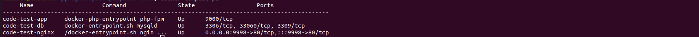

# Code Test StoryDriven

This project was build to support a code test for a developer position in StoryDriven


# Tecnologies

 - Docker
 - docker-compose
 - PHP 7.4 (Laravel 8)
 - Nginx
 - Mysql

# Instructions

To run the project, you will need have instaled in your enviroment

 - Docker
 - docker-compose


To start the project, run the command in project root folder:

```
docker-compose up -d
``` 

Verify if the containers are "UP" with the command:

```
docker-compose ps
```


After making sure that all containers are "UP", run the initial migration to create the basic application schema
``` 
docker-compose exec code-test-app php artisan migrate
```

To populate de users table with the initial data, execute the command

```
docker-compose exec code-test-app php artisan db:seed --class=UserSeeder
docker-compose exec code-test-app php artisan db:seed --class=TextsSeeder
```

Link API
https://documenter.getpostman.com/view/12057511/UVyrUboy